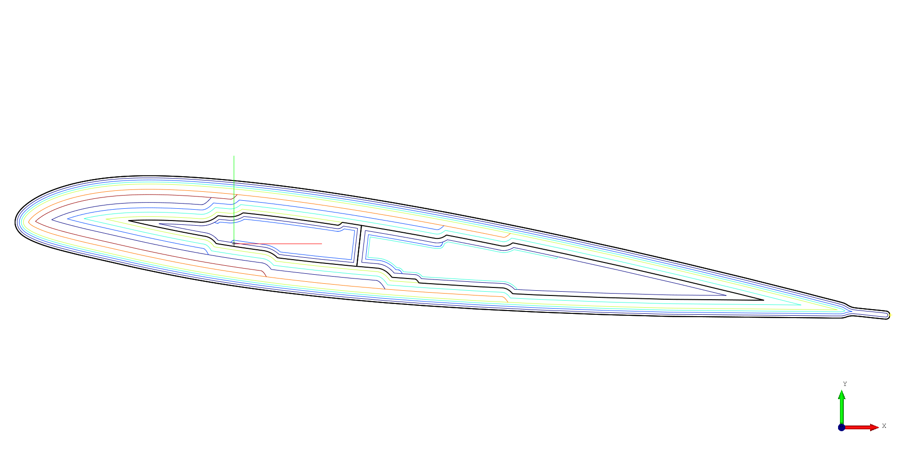

# SONATA: A Preprocessor for Parametric Analysis and Design of Composite Beam Cross-Sections in a Multidisciplinary Rotor Design Environment

 **SONATA** is a preprocessor for parametric analysis and design of composite beam cross-sections in a multidisciplinary rotor design environment. A helicopter rotor blade represents a classical aeroelastic problem, where the aerodynamic behavior, the structural elasticity and vibrational dynamics have to be studied simultaneously.  While a geometric definition of a rotorblade with CAD tools is simple, the transfer to a meshed cross-sectional representation may prohibit automated design optimization. Consequently, most researches have developed individual parametric mesh generators for the cross-sectional analysis, that reduces their structural model to few design variables in the process. SONATA represents such a preprocessor.
SONATA is written in python and is using for a lot of operations the Opencascade (CAD) kernel with its python wrapper (pythonocc). 


#SONATA helps the engineer to parameterize a closed composite rotor blade crossection with multiple spars. It is specifically designed to be suited for helicopter rotor blade crossections of the blade aerodynamic section and elastic blade root. SONATA combines visualization and 2D-Finite Element discretisation of the crossection. 

The first part of the software contains a parametric topology generator 
The topology is saved as a .pkl and can be reloaded
The second part generates a mesh upon the topology, the mesh can be exported into a VABS and SECTIONBUILDER conform PATRAN mesh file .ptr

More to come...


## Resources
* [PythonOCC](http://www.pythonocc.org/)

## Documentation for Developers:

* [OpenCascadeTechnology Documentation](https://www.opencascade.com/doc/occt-6.9.1/refman/html/index.html)
* [PythonOCC API Documentation](http://api.pythonocc.org/)

* Gallery
* Examples
* Wiki

## Installing

a python distribution is needed best use Anaconda 
Anaconda pythonocc-core,
install pythonocc-utils
install shapely

```html
<script src="https://d3js.org/d3.v4.js"></script>
```

For the minified version:

```html
<script src="https://d3js.org/d3.v4.min.js"></script>
```

You can also use the standalone D3 microlibraries. For example, [d3-selection](https://github.com/d3/d3-selection):

```html
<script src="https://d3js.org/d3-selection.v1.js"></script>
```

D3 is written using [ES2015 modules](http://www.2ality.com/2014/09/es6-modules-final.html). Create a [custom bundle using Rollup](http://bl.ocks.org/mbostock/bb09af4c39c79cffcde4), Webpack, or your preferred bundler. To import D3 into an ES2015 application, either import specific symbols from specific D3 modules:

```js
import {scaleLinear} from "d3-scale";
```

Or import everything into a namespace (here, `d3`):

```js
import * as d3 from "d3";
```

In Node:

```js
var d3 = require("d3");
```

You can also require individual modules and combine them into a `d3` object using [Object.assign](https://developer.mozilla.org/en-US/docs/Web/JavaScript/Reference/Global_Objects/Object/assign):

```js
var d3 = Object.assign({}, require("d3-format"), require("d3-geo"), require("d3-geo-projection"));
```