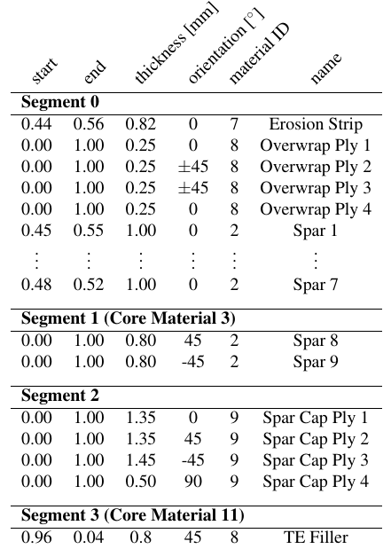
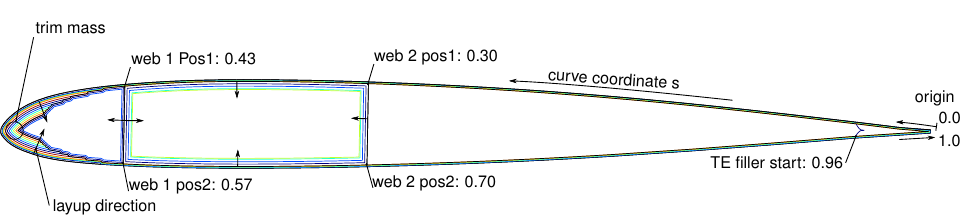
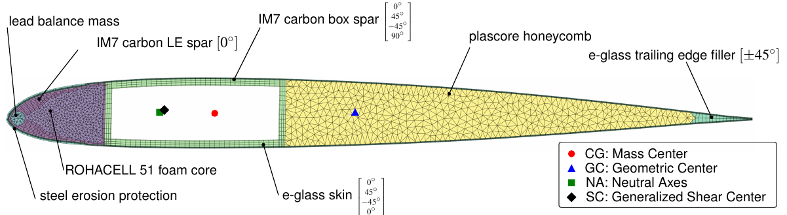
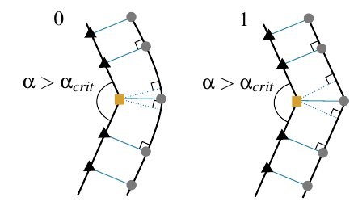
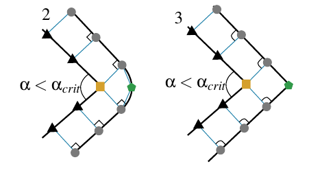
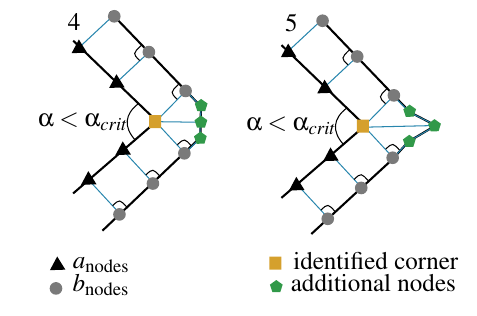
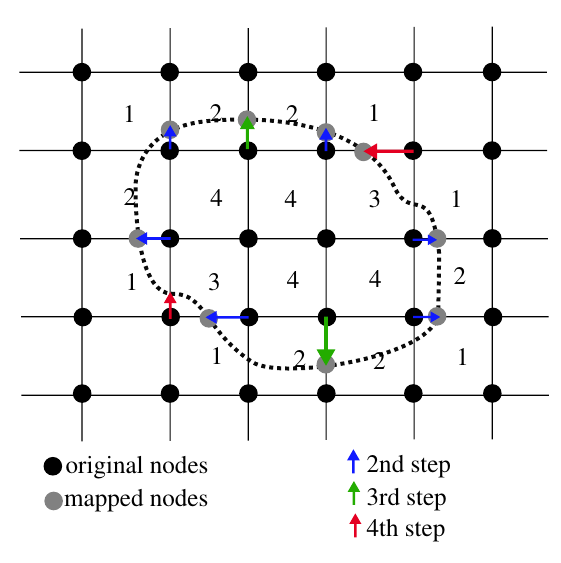
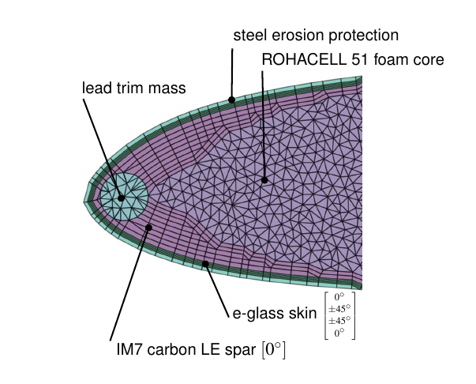

# SONATA: Multidiciplinary Rotor Blade Design Environment for Structural Optimization and Aeroelastic Analysis

## **Abstract:**

Structural helicopter rotor blade optimization comprises classical aeroelastic problems, where the aerodynamic behavior, the structural elasticity and vibrational dynamics have to be studied simultaneously. Since the dynamic and modal behavior is strongly related to the structural properties of the rotor blades, adjusting these properties is essential for an effective optimization. Nevertheless, identifying constraints based on elemental matrices to keep the solution within feasible boundaries is often a protracted and iterative task. The herein presented definition of the rotor blade topology is deliberately associated to the production of composite rotor blades. Thus, manufacturability is inherent from the geometric layup definition. Using orthogonal projection with corner-style differentiation the cross-section is discretized and processed by the Variational Asymptotic Beam Sectional Analysis (VABS) afterwards.

## Installation

To use the full functionality of SONATA a bunch of installations have to be made and packages to be gathered. In this section a brief installation guide is presented that will help the user to install it properly. 
SONATA is developed to work with a python version >3.6. An old python 2.7 release can be found under the tag v0.1

1. A **python > 3.6** distribution is needed. It is recommended to use anaconda for easier package management https://www.anaconda.com/download/

2. Install the **pythonocc** precompiled binaries for MacOSX/Linux/Windows 32 or 64 with the amazing conda package management system. Simply run the following commands in the terminal.
   ```	conda install -c conda-forge -c dlr-sc -c pythonocc -c oce pythonocc-core==0.17.3	```

3. Install the **pint** module. This is used to change units in the SONATA/CBM - DYMORE interface.
   ``` conda install -c conda-forge pint ```

4. Install the **intervaltree** package. This is used for structuring the topology and the calculation of layup coordinates. 
   ``` conda install -c conda-forge intervaltree ```

5. Install the **shapely** package. This is used for the discretization and approximation of offset curves during the topology generation process: *Windows*: Install the precompiled binaries from the /package directory by running the following command: ```pip install Shapely-1.6.4.post1-cp36-cp36m-win_amd64```; *Linux*: ```pip install shapely==1.6.4```

6. Install the **triangle** package. This is used for the unstructured triangulation of the cavities and balance weight materials during the meshing process: *Windows*: Install the precompiled binaries from the /packages directory by running the following command: ```pip install packages/triangle-20170106-cp27-cp27m-win_amd64.whl```; *Linux*: ```pip install triangle```

7. Install the **openmdao** package. This is the python package that provides the necessary framework for SONATA. you can either use the pip to install the openmdao or clone it directly from https://github.com/OpenMDAO/OpenMDAO ```pip install openmdao```

8. Test the installation and all packages by excecuting the folloging python script:
   ```	python test_install.py```	

9. Now you can download or clone the repository and execute the main SONATA script. 
   ```	python SONATA.py```

## Introduction:

The large number of constraints and design drivers from various disciplines makes the helicopter rotor blade development process difficult, time consuming and costly.
The entire design process represents a classical aeroelastic problem, where the aerodynamic behavior, the structural elasticity and vibrational dynamics have to be studied simultaneously. The behavior can therefore not be examined with separate analysis of the different disciplines [1]. The integration of all the appropriate disciplines in the design process implies not only limitations on the design from various disciplines, but also defining and accounting for interactions so that the disciplines influence design decisions simultaneously rather than sequentially [2].
Historically, the design and development of improved or entirely new rotor blades is conducted by departments in a company that maintain their separate simulation codes for performing their specific tasks. The aerodynamics department is responsible for performance calculations, aero-acoustics, rotor-wake interaction, unsteady airload prediction and computational fluid dynamics while the dynamics department focuses on rotor vibratory loads, stability and aeroelastic models [1]. The structural department determines the elastic properties as well as strength and fatigue characteristics.  A Blade and Rotor Design Department often bundles the different aspects while considering materials, manufacturability, maintainability and safety requirements. [1]
This modular approach narrows the scope of solutions, because each department focuses on individual objectives satisfied by individual design parameters. Mutual interactions can only be covered by numerous iterations.
In contrast to that, a multidisciplinary approach offers a more systematic development process that is able to design a better helicopter rotor [2]. Because of the impact the rotor behavior has on the overall performance of the helicopter and on customer noticeable vibratory characteristics, rotor aeroelastic effects should be considered in the earliest stages of the design process [3].
In the last 25 years, researchers have repeatedly stated the need for a design methodology and optimization framework that combines computational efficiency of a beam description in aeromechanic analysis with a rotor blade structural model that is capable at describing realistic composite rotor blade cross-sections with respect to the structural properties, applied load, stress and strain distributions as well as design constraints [4-6]. 

## Framework:

Our multidisciplinary rotor blade design framework is named SONATA (Structural Optimization and Aeroelastic Analysis) and is illustrated in the following figure 1. Like most environments it comprises of **three** main components that are wrapped into an optimization framework. 


Fig. 1: SONATA: Multidisciplinary Rotor Blade Design Environment for Structural Optimization and Aeroelastic Analysis embedded in OpenMDAO.

1. As a **first** component, the current state of the art involves an aeromechanical analysis of rotorcraft blades which includes flexible multibody dynamics, nonlinear finite elements and various rotorcraft aerodynamic models. They are often referred to as Comprehensive Analysis. Examples are the widely used Comprehensive Analytical Model of Rotorcraft Aerodynamics and Dynamics II (CAMRAD II) [9] and the software Dymore [10] beyond several others. Both of these codes are presently in use in the rotorcraft industry, academic institutions and government laboratories. The quality of the predictions have been documented in numerous publications. In our SONATA environment Dymore was chosen as aeromechanic tool for both a dynamic analysis in the time domain as well a modal analysis within the frequency domain. In this context classical 1D-beam elements are used to describe the rotor blade due to the much simpler mathematical formulation and reduced computational effort compared to a full three-dimensional finite element model of the composite rotor blade [11]. Typically, this approach decouples the realistic composite blade definition and the manufacturability constraints from the aeromechanic analysis and the predesign of structural blade properties. That way, problems in the blade design cannot be discovered until later in the process where changes are costly and time consuming [12]. 

2. Although the three-dimensional finite element method is the most accurate approach to model realistic rotor blades, it is still not appropriate for the use in rotor blade predesign [11, 13]. The slender characteristic of rotor blades allows the simplification to treat them as one-dimensional body [14] Cesnik and Hodges [15] formulated the Variational Asymptotic Beam Sectional Analysis (VABS) to accurately represent the behavior that is associated with the reduction of two-dimensions. In other words, this method splits the three-dimensional elastic problem into a two-dimensional linear cross-section analysis and a one-dimensional nonlinear beam analysis, which is able to consider initially twisted and curved, anisotropic, non-homogeneous materials to model general composite cross-sectional geometries [13, 15]. VABS is the **second** component of our environment. In the last 20 years, VABS and its variations have become a popular tool in rotor blade predesign and multidisciplinary rotor design optimization and their accuracy and efficiency has been validated in numerous publications [3, 15, 16].

3. Consequently, most researches have developed individual parametric mesh generators for the cross-sectional analysis, that reduces their structural model to few design variables in the process. Such a preprocessor for parametric composite rotor blade cross-sections is referred to as *SONATA-CBM* in this framework. It is the **third** component of the SONATA environment. 

Last but not least, the tree components are managed by an environment where design variables and objectives can be defined, constraints to be applied and solvers to be launched. The **SONATA** framework uses [OpenMDAO](http://openmdao.org/)  [7, 8, 27], an open-source computing platform for system analysis and multidisciplinary optimization, written in Python. It allows the user to break down the structure of complex optimization tasks into a hierarchic manner while managing the numerical methods. A Python-based wrapper for Dymore has been developed to integrate the dynamic and modal analysis into the OpenMDAO-driven optimizations. Consequently *SONATA-CBM* has been written in Python using the Python wrapper for the CAD-Kernel Opencascade [pythonOCC](http://www.pythonocc.org/ ). 

**Why Python?**

-  Python can be easy to pick up whether you're a first time programmer or you're experienced with other languages. 
-  Python is developed under an OSI-approved open source license, making it freely usable and distributable, even for commercial use. 
-  The Python Package Index (PyPI) hosts thousands of third-party modules for Python. Both Python's standard library and the community-contributed modules allow for endless possibilities. Two of the most important python modules used in SONATA are the openMDAO and the pythonocc module.
-  [openMDAO](http://openmdao.org/) is an open-source high-performance computing platform for systems analysis and multidisciplinary optimization, written in Python.
-   [pythonOCC](http://www.pythonocc.org/ )  is a python library whose purpose is to provide 3D modeling features. It is intended to developers who aim at developing CAD/PDM/PLM applications.

### 1. DYMORE (PYMORE):

A Python-based wrapper for Dymore has been developed to integrate the dynamic and modal analysis into the OpenMDAO-driven optimizations.

This module is developed by W. Garre and is hosted @ [https://gitlab.lrz.de/wgarre/Pymore](https://gitlab.lrz.de/wgarre/Pymore)

### 2. VABS (Variational Asymptotic Beam Sectional Analysis):

http://analyswift.com/vabs-cross-sectional-analysis-tool-for-composite-beams/

Analyswift: Free Academic Licenses for Universities

### 3. SONATA-CBM:
*SONATA-CBM'*s composite topology generation originates from an arbitrary closed curve that can be obtained from various input formats that range from airfoil coordinate tables over a 3D CAD rotor blade surface  definition (.step or .iges) with radial station to a parameterized rotor blade with twist, planform, airfoil and chord-line distribution. In the case of the latter two, the 3D surface is intersected at a certain radial station to obtain once again a two-dimensional outer boundary of the cross-section. Figure 2 shows the resulting parameterized 3D surface of the UH-60A rotor blade with a cross-section topology at radial station R = 2000 mm.\\
While the following methodology is shown  with the example of the UH-60A rotor-blade, it should be noted that this procedure can be applied to any closed curve cross-section, and therefore be also used to model rotor blade root sections or any other composite beam cross-sections. 


Fig. 2: Parameterized 3D surface of the UH-60A rotor blade created with twist, planform, airfoil and axis information from Davis [29]

#### Topology Generation

The process behind the composite topology generation is derived from the manufacturing process, where the layers are placed on top of each other in negative molds in a consecutive manner to avoid complex constraints in the optimization and to keep the solution within proper bounds. Each layer has an assigned material with start and end coordinates, a thickness and fiber orientation (see table 1). Every parameter or groups of them can serve as design variable in the later optimization. After the layup process on top of the outer boundary curve is completed, webs are introduced and subsequently new closed curved geometries are generated where the layup procedure is repeated. Cavities can be filled with core materials and additional trim masses can be inserted.
At first the outer boundary curve, represented as counterclockwise sets of consecutive B-splines, is defined in curve coordinates **s** between zero and one. The origin is typically located at the trailing edge (TE). The curve coordinate system propagates through the layers with an interval tree structure. It allows to efficiently find the intervals/layers that overlap and locate the corresponding coordinate for each layer. 
Subsequently, each layer is generated by the following consecutive steps. 

- Determine the relevant set of underlying B-Splines between *start* and *end* coordinate of the layer using an interval tree data structure.
- Discretize the set of B-Splines and perform an parallel offset to return an approximate representation of all points with a given thickness of each layer.
- Generate a new set of B-Splines by interpolation and add smooth layer cutoffs to connect the lower and upper set of B-Splines if necessary.

In table 1 the layup definition of the cross-section, illustrated in figure 3, is displayed. Note that the shown genetic composite cross-section of the UH-60A serves as demonstration of the modeling capabilities.




Table 1: Layup definition of figure 3



Fig. 3: Topology definition of a generic composite UH-60A rotor blade cross section.

​	

Fig. 4: SONATA-CBM discretization of a generic composite UH-60A rotor blade cross-section in reference to [3] to illustrate the modeling capabilities.

The first set of layers are grouped into Segment 0. The first layer that is generated is a steel erosion protection strip that ranges from coordinate 0.44 to 0.56 with a thickness of 0.82mm. Because of the isotropic material used, the orientation can be neglected for this layer. The material ID represents a reference index of an associated material database. The next 4 layers define the skin of the rotor blade placed in both 0°and +-45° orientation on top of each other. The layers Spar 1 to Spar 7 are unidirectional carbon fiber composite layers that generate a C type spar with ply drops in the leading edge region of the cross-section.
Once the first set of layers (Segment 0) has been created, webs are introduced to the structure. They are defined as straight line between two positions. In this example the first web ranges from coordinate 0.43 to 0.57 while the second is placed behind from 0.30 to 0.70. The three newly generated closed curved geometries are used to repeat the layup procedure. During the manufacturing process this translates to a process of wrapping plies around a core. A core material is assigned to Segment 1 and 3 that fills up the remaining cavity. Segment 2 consists of four carbon fiber layers of different orientation from 0 to 1 to generate a hollow box spar. After the layup is defined a trim mass can be placed on top of the existing layers and will be integrated in the structure during the discretization.

#### Discretization:

The discretization follows the topology generation procedure, yet in a reversed direction with respect to the layup definition, starting from the innermost layers and moving outwards. Each layer is meshed by an orthogonal projection with corner style differentiation. 
Figure 4 shows the final result of the described procedure.

Each layer can be described by two sets of B-splines, the inner a_bsplines and outer b_bsplines. The nodes placed on them are called accordingly a_nodes and b_nodes. 
The following procedure is applied to each layer, starting at the innermost, and moving outwards. 

- Determine existing a_nodes based on the intervaltree structure of the layup. If sections on the a_bsplines are found with no preexisting nodes, distribute new nodes equidistantly. 
- Create an orthogonal projection of each a_node onto the set of b_bsplines. If two or more projections are found determine the angle alpha and the number of potential b_bsplines corners between them.
- Based on a critical angle alpha_crit and the number of exterior corners determine the corner style and as a consequence the meshing procedure. In figure 5-7 the first 6 different corner styles are shown.   
- After all nodes are placed on both sets of B-splines, they are connected to form cells with associated  material and ply angles.
- In subsequent steps sharp cells, large aspect-ratio cells and cell angles are modified to improve mesh quality. 

As soon as every layer of the segment is meshed, the remaining cavities are triangulated using Shewchuk [30] algorithm with an area constraint. To avoid hanging nodes between two neighboring segments, the cells are consolidated on web interfaces.





Fig. 5-7: Corner-style **0**: no exterior corner on bbsplines and α > αcrit ; Corner-style **1**: one exterior corner on bbsplines and α > αcrit. Corner-style **2**: no exterior corner on bbsplines and α < αcrit ; Corner-style **3**: one exterior corner on bbsplines and α < αcrit.  Corner-style **4**: two exterior corners on bbsplines and α < αcrit ; Corner-style **5**: three exterior corners on bbsplines and α < αcrit.

In a final step, the previously defined trim mass is integrated into the described mesh by mapping existing nodes onto the trim mass contour. The corresponding algorithm is schematically illustrated in Figure [8] and described below:

- Determine the number of inner nodes of the intersected cells. 
- Move the inner nodes of the cells marked *1* along the cell edge with shortest distance to the intersecting curve.
- Move the remaining inner nodes of the cells marked *2* along the cell edge with shortest distance to the intersecting curve.
- Move the outer node of the cells marked *3* along the edge direction onto the intersecting curve.
- Delete cells marked *3* and *4.*
- Use the boundary nodes as starting point for the inner triangulation.  



Fig. 8-9: (Left) Mapping algorithm to integrate cuves into an existing mesh. (Right) Leading edge region of figure 4 showing the plydrops of the C-Spar and the integration of the trim mass into the existing mesh.

The final result is displayed in the magnified cutout of the leading edge region in figure 9. Finally, the VABS input files are generated from the mesh together with the material information from an associated database. 

To verify the resulting stiffness properties, simple benchmark testcases for isotropic and anisotropic box-beam cross-sections have been set up and compared to results from [31]. Moreover, the rotor blades of the institute's high altitude synchropter UAV (AREA) [32, 33] have been reengineered with SONATA-CBM and compared to experimental results from Suesse [34].


## Resources
* [PythonOCC](http://www.pythonocc.org/)
* [openMDAO](http://openmdao.org/)

Documentation for Developers:

* [OpenCascadeTechnology Documentation](https://www.opencascade.com/doc/occt-6.9.1/refman/html/index.html)
* [PythonOCC API Documentation](http://api.pythonocc.org/)
* [OpenMDAO Documentation](http://openmdao.org/twodocs/versions/latest/)

## Publications:
**Pflumm, T., Garre, W., Hajek, M.:** A Preprocessor for Parametric Composite Rotor Blade Cross-Sections, 44th European Rotorcraft Forum, Delft, The Netherlands, 2018  [[mehr…\]](https://mediatum.ub.tum.de/604993?query=Pflumm&show_id=1455385) [[BibTeX\]](https://mediatum.ub.tum.de/export/1455385/bibtex)


## Referencencs:
[1] Tarzanin, F. and Young, D., “Boeing rotorcraft experience with rotor design and optimization,” 7th
AIAA/USAF/NASA/ISSMO Symp. Multidiscip. Anal. Optim., American Institute of Aeronautics and Astronautics, Reston, Virigina, sep 1998. [http://arc.aiaa.org/doi/abs/10.2514/6.1998-4733](http://arc.aiaa.org/doi/abs/10.2514/6.1998-4733).

[2] Adelman, H. M. and Mantay, W. R., “Integrated Multidisciplinary Optimization of Rotorcraft: A Plan for Development,” Tech. rep., NASA, 1989.

[3] Rohl, P. J., Kumar, D., Dorman, P., Sutton, M., and Cesnik, C. E. S., “A Composite Rotor Blade Structural
Design Environment for Aeromechanical Assessments in Conceptual and Preliminary Design,” American Helicopter Society 68th Annual Forum, American Helicopter Society, 2012. [http://ebooks.cambridge.org/ref/id/CBO9781107415324A009](http://ebooks.cambridge.org/ref/id/CBO9781107415324A009).

[4] Friedmann, P. P., “Helicopter Vibration Reduction Using Structural Optimization with Aeroelas-
tic/multidisciplinary Constraints - A Survey,” Journal of Aircraft, Vol. 28, No. 1, jan 1991, pp. 8–21. http://dx.doi.org/10.2514/3.45987](http://dx.doi.org/10.2514/3.45987).

[5] Weller, W. H. and Davis, M. W., “Wind Tunnel Tests of Helicopter Blade Designs Optimized for Minimum Vibration,” American Helicopter Society 44th Annual Forum, 1988.  [

[9]Johnson, W., “A History of Rotorcraft Comprehensive Analyses,” American Helicopter Society 60th Annual Forum, 2013. 

[10] Bauchau, O., Bottasso, C., and Nikishkov, Y., “Modeling rotorcraft dynamics with finite element multi-
body procedures,” Mathematical and Computer Modelling, Vol. 33, No. 10-11, 2001, pp. 1113–1137.

[11] Datta, A. and Johnson, W., “Three-Dimensional Finite Element Formulation and Scalable Domain Decomposition for High-Fidelity Rotor Dynamic Analysis,” Journal of the American Helicopter Society, 2011.

[12] Rohl, P., Dorman, P., Sutton, M., Kumar, D., and Cesnik, C., “A Multidisciplinary Design Environment for Composite Rotor Blades,” 53rd AIAA/ASME/ASCE/AHS/ASC Structures, Structural Dynamics and Materials Conference, No. April, American Institute of Aeronautics and Astronautics (AIAA), Reston, Virigina, apr 2012, pp. 1–15.  http://dx.doi.org/10.2514/6.2012-1842](http://dx.doi.org/10.2514/6.2012-1842). 

[13] Li, L., Structural Design of Composite Rotor Blades with Consideration of Manufacturability, Durability, and Manufacturing Uncertainties, Ph.d. thesis, Georgia Institute of Technology, 2008.

[14] Yeo, H., Truong, K.-V., and Ormiston, R. A., “Asessment of 1D Versus 3D Methods for Modeling Rotor Blade Structural Dynamics,” AIAA, 2010.

[15] Cesnik, C. E. S. and Hodges, D. H., “VABS: A New Concept for Composite Rotor Blade Cross-Sectional Modeling,” American Helicopter Society 51st Annual Forum, 1995.

[16] Cesnik, C., Mok, J., Parikh, A., and Shin, S., “Optimum Design Framework for Integrally Twisted Helicopter
Blades,” 45th AIAA/ASME/ASCE/AHS/ASC Structures, Structural Dynamics and Materials Conference, Ameri-
can Institute of Aeronautics and Astronautics (AIAA), apr 2004.

[17] Kumar, D. and Cesnik, C. E., “Optimization Framework for the Dynamic Analysis and Design of Active Twist Rotors,” American Helicopter Society 68th Annual Forum, 2012.

[18] Kumar, D. and Cesnik, C. E., “New Hybrid Optimization for Design of Active Twist Rotors,” 54th
AIAA/ASME/ASCE/AHS/ASC Structures, Structural Dynamics, and Materials Conference, American Institute of Aeronautics and Astronautics (AIAA), 2013. 

[19] Silva, C. and Johnson, W., “Multidisciplinary Conceptual Design for Reduced-Emission Rotorcraft,” AHS
Specialists Conference on Aeromechanics Design for Transformative Vertical Flight, AHS, San Francisco, Cali-
fornia, jan 2018.

[20] Meyn, L., “Rotorcraft Optimization Tools: Incorporating Rotorcraft Design Codes into Multi-Disciplinary Design, Analysis, and Optimization,” .

[21] Glaz, B., Friedmann, P. P., and Liu, L., “Helicopter Vibration Reduction throughout the Entire Flight Enve-
lope Using Surrogate-Based Optimization,” Journal of the American Helicopter Society, Vol. 54, No. 1, 2009.
[22] Glaz, B., Friedmann, P. P., Liu, L., Kumar, D., and Cesnik, C. E. S., “The AVINOR Aeroelastic Simulation
Code and its Application to Reduced Vibration Composite Rotor Blade Design,” 50th AIAA/ASME/ASCE/AHS/ASC Structures, Structural Dynamics, and Materials Confer-
ence, 2009. 

[23] Yu, W., Volovoi, V., Hodges, D. H., and Hong, X., “Validation of the variational asymptotic beam sectional analysis,” AIAA Journal, Vol. 40, No. 10, jan 2002,
pp. 2105–2112. 

[24] Tian, S., Liu, X., and Yu, W., “PreVABS,
https://cdmhub.org/resources/1597,” Nov 2017.

[25] Fanjoy, D. and Crossley, W., “Using a Genetic Algorithm for Structural Topology Design of Helicopter Ro-
tor Blades,” 19th AIAA Applied Aerodynamics Conference, American Institute of Aeronautics and Astronautics (AIAA), jun 2001.

[26] Blasques, J. P., “Multi-material topology optimization of laminated composite beams with eigenfrequency constraints,” Composite Structures, Vol. 111, 2013, pp. 45 – 55.

[27] Heath, C. M. and Gray, J. S., “OpenMDAO: Framework for Flexible Multidisciplinary Design, Analysis and
Optimization Methods,” 8th AIAA Multidisciplinary Design Optimization Specialist Conference (MDO), Hon-
olulu, Hawaii, 2012, pp. 1–13. 

[28] Paviot, T., “pythonOCC, 3D CAD/CAE/PLM development framework for the Python programming language,http://www.pythonocc.org/,” .

[29] Davis, S. J., “Predesign Study For a Modern 4-Bladed Rotor for the RSRA,” Tech. Rep. 16155, NASA, 1981.

[30] Shewchuk, J. R., “Triangle: Engineering a 2D Quality Mesh Generator and Delaunay Triangulator,” Applied Computational Geometry: Towards Geometric Engineering, Vol. 1148 of Lecture Notes in Computer Science, Springer-Verlag, 1996, pp. 203–222.

[31] Popescu, B. and Hodges, D. H., “On asymptotically correct Timoshenko-like anisotropic beam theory,” Inter national Journal of Solids and Structures, Vol. 37, No. 3, 2000, pp. 535 – 558.

[32] Barth, A., Spiess, C., Kondak, K., and Hajek, M., “Design, Analysis and Flight Testing of a High Altitude
Synchropter UAV,” American Helicopter Society 74th Annual Forum, 2018.

[33] Pflumm, T., Barth, A., Kondak, K., and Hajek, M., “Auslegung und Konstruktion eines Hauptrotorblattes fuer ein in extremen Flughoehen operierendes Drehfluegel UAV,” Deutscher Luft- und Raumfahrtkongress 2015, Rostock, Germany, 2015.

[34] Suesse, S. and Hajek, M., “Rotor Blade Displacement and Load Estimation with Fiber-Optical Sensors for a Fu ture Health and Usage Monitoring System,” American Helicopter Society 74th Annual Forum, 2018.

[35] McColl, C., Palmer, D., Chierichetti, M., Bauchau, O. A., and Ruzzene, M., “Comprehensive UH-60 Loads
Model Validation,” AHS Forum, 2010. [36]Bowen-Davies, G. M., Performance and Loads of Variable Top Speed Rotorcraft at High Advance Ratios, Ph.D. thesis, University of Maryland, 2015.

## Acknowledgment:

This work is supported by the German Federal Minisfor Economic Affairs and Energy through the German Aation Research Program LuFo V-2 and the Austrian Rsearch Promotion Agency through the Austrian ReseaProgram TAKE OFF in the project VARI-SPEED.


