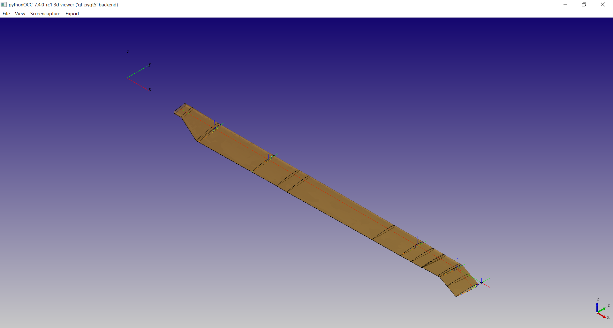
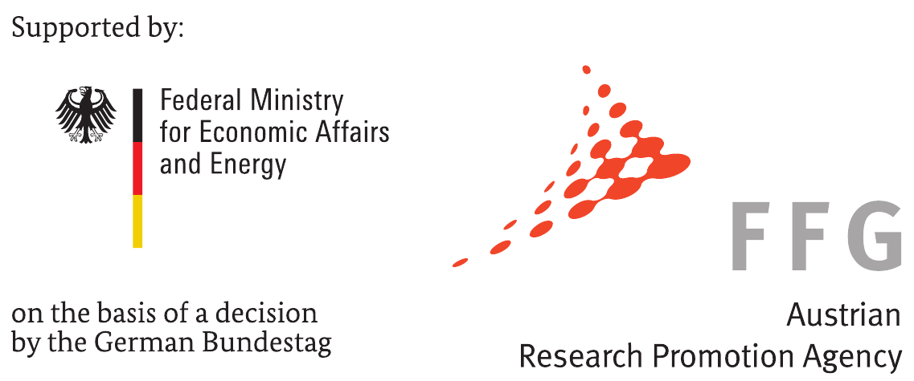

# SONATA

'SONATA' is a toolbox for Multidiciplinary Rotor Blade Design Environment for Structural Optimization and Aeroelastic Analysis.
Structural helicopter rotor blade optimization comprises classical aeroelastic problems, where the aerodynamic behavior, the structural elasticity and vibrational dynamics have to be studied simultaneously. 
Since the dynamic and modal behavior is strongly related to the structural properties of the rotor blades, adjusting these properties is essential for an effective optimization. 
Nevertheless, identifying constraints based on elemental matrices to keep the solution within feasible boundaries is often a protracted and iterative task. 
The herein presented definition of the rotor blade topology is deliberately associated to the production of composite rotor blades. 
Thus, manufacturability is inherent from the geometric layup definition. Using orthogonal projection with corner-style differentiation the cross-section is discretized and processed by the Variational Asymptotic Beam Sectional Analysis (VABS) afterwards. [more](docs/intro.md)

## Installation
To use the full functionality of SONATA a bunch of dependecies are needed. Please look [here](docs/installation.md) for detailed instructions.

```
$ git clone https://gitlab.lrz.de/gu32kij/SONATA.git
$ cd SONATA
$ pip install .
```


## Usage

```
>>> from SONATA.classBlade import Blade

>>> job = Blade(filename='merit.yml')
>>> job.blade_gen_section()
```

Plot the Mesh of Cross-section
```
>>> job.blade_plot_sections()
```


Show Results in the 3D-Viewer
```
>>>job.blade_post_3dtopo(flag_lft = True, flag_topo = True, flag_mesh = False)
```


[getting-started](docs/getting_started.md)

## Developers - Guide
please read the [developers-guide](docs/developer-guide.md)

## Publications:

**Pflumm, T., Garre, W., Hajek, M.:** A Preprocessor for Parametric Composite Rotor Blade Cross-Sections, 44th European Rotorcraft Forum, Delft, The Netherlands, 2018  [[pdf]](docs/Pflumm,%20T.%20-%20A%20Preprocessor%20for%20Parametric%20Composite%20Rotor%20Blade%20Cross-Sections%20(2018,%20ERF).pdf) [[more…\]](https://mediatum.ub.tum.de/604993?query=Pflumm&show_id=1455385) [[BibTeX\]](https://mediatum.ub.tum.de/export/1455385/bibtex)

**Pflumm, T., Rex, W., Hajek, M.:** Propagation of Material and Manufacturing Uncertainties in Composite Helicopter Rotor Blades, 45th European Rotorcraft Forum, Warsaw, Poland, 2019 [[more…\]](https://mediatum.ub.tum.de/1520025) [BibTeX\]](https://mediatum.ub.tum.de/export/1520025/bibtex)


## Acknowledgment:

This work was supported by the German Federal Minisfor Economic Affairs and Energy through the German Aation Research Program LuFo V-2 and the Austrian Rsearch Promotion Agency through the Austrian Research Program TAKE OFF in the project VARI-SPEED.


