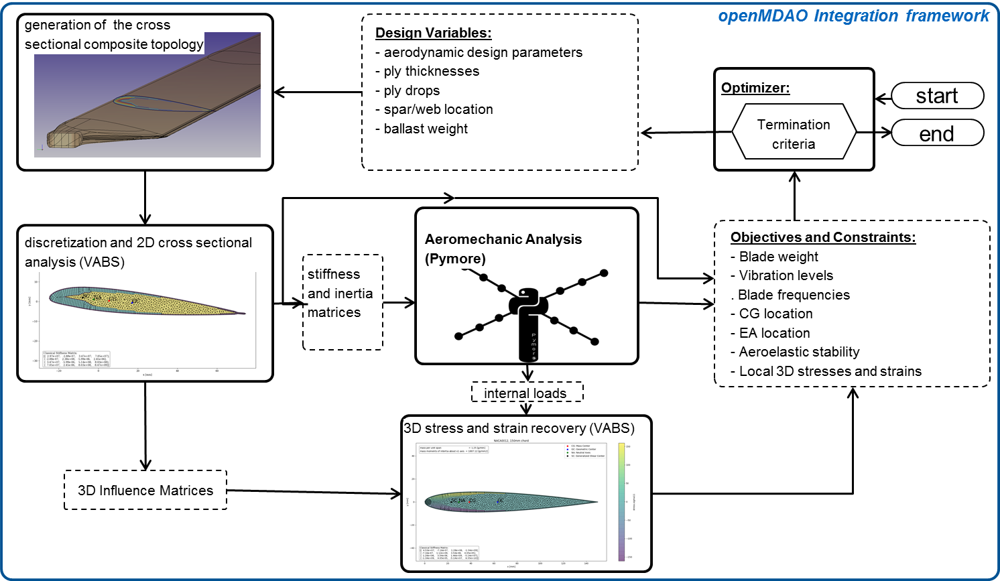
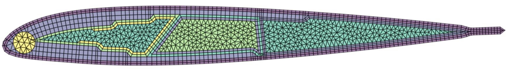

# SONATA: Multidiciplinary Rotor Blade Design Environment for Structural Optimization and Aeroelastic Analysis

 The large number of constrains and design drivers from various disciplines makes the helicopter rotor blade development
process difficult, time consuming and costly.
A helicopter rotor blade represents a classical aeroelastic problem, where the aerodynamic behavior, the structural
elasticity and vibrational dynamics have to be studied simultaneously. The behavior can therefore not be examined
with a loosely coupled analysis of the different disciplines [1]. The integration of all the appropriate disciplines in the
design process implies not only limitations on the design from various disciplines, but also defining and accounting for
interactions so that the disciplines influence design decisions simultaneously rather than sequentially [2].

## Introduction:
The large number of constrains and design drivers from various disciplines makes the helicopter rotor blade development process difficult, time consuming and costly. A helicopter rotor blade represents a classical aeroelastic problem, where the aerodynamic behavior, the structural elasticity and vibrational dynamics have to be studied simultaneously. The behavior can therefore not be examined with a loosely coupled analysis of the different disciplines [1]. The integration of all the appropriate disciplines in the design process implies not only limitations on the design from various disciplines, but also defining and accounting for interactions so that the disciplines influence design decisions simultaneously rather than sequentially [2]. Historically, the design and development of improved or entirely new rotor blades is conducted by departments in a company that maintain there separate simulation codes for performing their specific tasks. The aerodynamics department is responsible for performance calculations, aero-acoustics, rotor-wake interaction, unsteady airload prediction and computational fluid dynamics while the dynamics department focuses on rotor vibratory loads, stability and aeroelastic models[1]. The structural department determines the elastic properties as well as strength and fatigue characteristics. A
Blade and Rotor Design Department often bundles the different aspects while considering also materials, manufacturability, maintainability, safety requirements etc. [1]. 

In contrast to that, a multidisciplinary approach offers a more systematic development process that is capable to develop a better helicopter [2]. Because of the impact the rotor behavior has on the overall performance of the helicopter and customer noticeable vibratory characteristics, rotor aeroelastic effects should be considered in the earliest stages of the design process [3].
Classical 1D-beam elements are usually used to describe the rotor blade at an early design stage due to the much simpler mathematical formulation compared to a complete 3D finite element model of the composite rotor blade. Typically, this approach decouples the realistic composite blade definition and the manufacturability constraints from the aeromechanic analysis and the predesign of structural blade properties. That way, problems in the blade design cannot be discovered until later in the process where changes are costly and time consuming [4].

In the last 25 years, researches have stated the need for a design methodology and optimization framework that combines computational efficiency of a beam description in aeromechanic analysis with a rotor blade structural model that is able to describe realistic composite rotor blade cross-sections with respect to the structural properties, applied load, stress and strain distributions as well as design constraints [5–7]. __SONATA provides such an optimization ennvironment__.

### Framework:
The framework to bundle the necessary tools for designing and analysing a helicopter rotorblade is written in [Python](https://www.python.org "Python"). 

-  Python can be easy to pick up whether you're a first time programmer or you're experienced with other languages. 
- Python is developed under an OSI-approved open source license, making it freely usable and distributable, even for commercial use. 
- The Python Package Index (PyPI) hosts thousands of third-party modules for Python. Both Python's standard library and the community-contributed modules allow for endless possibilities. Two of the most important python modules used in SONATA are the openMDAO and the pythonocc module.
- [openMDAO](http://openmdao.org/) is an open-source high-performance computing platform for systems analysis and multidisciplinary optimization, written in Python.
- [pythonocc](http://www.pythonocc.org/ "pythonocc") is a python library whose purpose is to provide 3D modeling features. It is intended to developers who aim at developing CAD/PDM/PLM applications.

### Flowchart:



##### 1. SONATA-CBM:
is a preprocessor for parametric analysis and design of composite beam cross-sections in a multidisciplinary rotor design environment. A helicopter rotor blade represents a classical aeroelastic problem, where the aerodynamic behavior, the structural elasticity and vibrational dynamics have to be studied simultaneously.  While a geometric definition of a rotorblade with CAD tools is simple, the transfer to a meshed cross-sectional representation may prohibit automated design optimization. Consequently, most researches have developed individual parametric mesh generators for the cross-sectional analysis, that reduces their structural model to few design variables in the process. SONATA represents such a preprocessor.
SONATA is written in python and is using for a lot of operations the Opencascade (CAD) kernel with its python wrapper (pythonocc). 

SONATA helps the engineer to parameterize a closed composite rotor blade crossection with multiple spars. It is specifically designed to be suited for helicopter rotor blade crossections of the blade aerodynamic section and elastic blade root. SONATA combines visualization and 2D-Finite Element discretisation of the crossection. 

The first part of the software contains a parametric topology generator 
The topology is saved as a .pkl and can be reloaded
The second part generates a mesh upon the topology, the mesh can be exported into a VABS and SECTIONBUILDER conform PATRAN mesh file .ptr



##### 2. SONATA-MARC (python module for the DYMORE Multibody Aeromechanics tool):
this module comes [https://gitlab.lrz.de/wgarre/Pymore](https://gitlab.lrz.de/wgarre/Pymore)


## Installation
To use the full functionality of SONATA a bunch of installations have to be made and packages to be gathered. In this section a brief insallation guide is presented that will help the user to install it properly. 
SONATA is developed to work with a python version >3.6. An old python 2.7 release can be found under the tag v0.1

1. A python 2.7 distribution is needed. It is recommended to use use Anaconda for easier package management https://www.anaconda.com/download/
2. Install the **pythonocc** precompiled binaries for MacOSX/Linux/Windows 32 or 64 with the amazing conda package management system. Simply run the following commands in the terminal (for Windows users: execute the cmd command terminal):
    ```	conda install -c conda-forge -c dlr-sc -c pythonocc -c oce pythonocc-core==0.18	```

3. Install the **pint** module. This is used to change units in the SONATA/CBM - DYMORE interface.
    ``` conda install -c conda-forge pint ```

4. Install the **intervaltree** package. This is (will be) used for structuring the topology and the calculation of layup coordinates. 
	* ` conda install -c bioconda intervaltree `

5. Install the **shapely** package. This is used for the discretization and approximation of offset curves during the topology generation process:
	* __Windows__: Install the precompiled binaries from the /package directory by running the following command: 
		
        ```pip install Shapely-1.6.4.post1-cp36-cp36m-win_amd64```
	* Linux: ```pip install shapely==1.6.4```
	
6. Install the **triangle** package. This is used for the unstructured triangulation of the core and balance weight materials during the meshing process:
	* __Windows__: Install the precompiled binaries from the /packages directory by running the following command: 
		
        ```pip install packages/triangle-20170106-cp27-cp27m-win_amd64.whl```
	* __Linux__: ```pip install triangle```

7. Install the **intervaltree** package. This is (will be) used for structuring the topology and the calculation of layup coordinates. 
	* ` conda install -c bioconda intervaltree `

8. Install the **openmdao** package. This is the python package that provides the necessary framework for SONATA. you can either use the pip to install the openmdao or clone it directly from https://github.com/OpenMDAO/OpenMDAO
	
	* ```pip install openmdao```
    
    To use the pyoptsparse optimisation package within openmdao you need to install conda-	build ` conda install conda-build`. Then clone or download the repository from https://bitbucket.org/mdolab/pyoptsparse and build it like so ` conda build pyoptsparse `.   To use parallel computing features you need to follow the following instructions https://openmdao.readthedocs.io/en/1.7.3/getting-started/mpi_windows.html
	
9. Test the installation and all packages by excecuting the folloging python script:
	```	python test_install.py```

10. Now you can download or clone the repository and execute the main SONATA script. 
	```	python SONATA.py```


## Resources
* [PythonOCC](http://www.pythonocc.org/)
* [openMDAO](http://openmdao.org/)


#### Documentation for Developers:

* [OpenCascadeTechnology Documentation](https://www.opencascade.com/doc/occt-6.9.1/refman/html/index.html)
* [PythonOCC API Documentation](http://api.pythonocc.org/)
* [OpenMDAO Documentation](http://openmdao.org/twodocs/versions/latest/)

## Publications:
to follow...


## Referencencs:
[1] Tarzanin, F., and Young, D., “Boeing rotorcraft experience with rotor design and optimization,” 7th AIAA/USAF/ ASA/ISSMO Symp. Multidiscip. Anal. Optim., American Institute ofAeronautics and Astronautics, Reston,Virigina, 1998. doi:10.2514/6.1998-4733, URL [http://arc.aiaa.org/doi/abs/10.2514/6.1998-4733](http://arc.aiaa.org/doi/abs/10.2514/6.1998-4733).

[2] Adelman, H. M., and Mantay, W. R., “Integrated Multidisciplinary Optimization of Rotorcraft: A Plan for  Development,” Tech. rep., NASA, 1989.

[3] Rohl, P. J., Kumar, D., Dorman, P., Sutton, M., and Cesnik, C. E. S., “A Composite Rotor Blade Structural Design Environment for Aeromechanical Assessments in Conceptual and Preliminary Design,” American Helicopter Society 68th Annual Forum, American Helicopter Society, 2012. URL [http://ebooks.cambridge.org/ref/id/CBO9781107415324A009](http://ebooks.cambridge.org/ref/id/CBO9781107415324A009).

[4] Rohl, P., Dorman, P., Sutton, M., Kumar, D., and Cesnik, C., “A Multidisciplinary Design Environment for Composite Rotor Blades,” 53rd AIAA/ASME/ASCE/AHS/ASC Structures, Structural Dynamics and Materials Conference, American Institute of Aeronautics and Astronautics (AIAA), Reston, Virigina, 2012, pp. 1–15. doi:10.2514/6.2012-1842, URL [http://dx.doi.org/10.2514/6.2012-1842](http://dx.doi.org/10.2514/6.2012-1842). 

[5] Friedmann, P. P., “Helicopter Vibration Reduction Using Structural Optimization with Aeroelastic/multidisciplinary Constraints- A Survey,” Journal of Aircraft, Vol. 28, No. 1, 1991, pp. 8–21. doi:10.2514/3.45987, URL [http://dx.doi.org/10.2514/3.45987](http://dx.doi.org/10.2514/3.45987).

6] Weller, W. H., and Davis, M. W., “Wind Tunnel Tests of Helicopter Blade Designs Optimized for Minimum Vibration,”
American Helicopter Society 44th Annual Forum, 1988.

[7] Lim, J., Shin, S., and Kee, Y., “Optimization of Rotor Structural Design in Compound Rotorcraft with Lift Offset,” Journal of the American Helicopter Society, Vol. 61, No. 1, 2016, pp. 1–14. doi:10.4050/jahs.61.012005, URL [http://dx.doi.org/10.4050/JAHS.61.012005](http://dx.doi.org/10.4050/JAHS.61.012005).